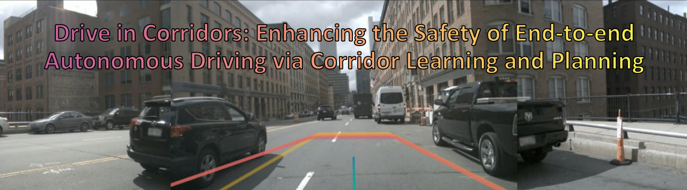

<h1>Drive in Corridors</h1>
<h3>Enhancing the Safety of End-to-end Autonomous Driving  via Corridor Learning and Planning</h3>

Zhiwei Zhang1, Ruichen Yang1, Ke Wu1, Zijun Xu1, Jingchu Liu2, Lisen Mu2, Zhongxue Gan1, Wenchao Ding1 :email:

1 Fudan University 2 Horizon Robotics (:email:) corresponding author.
Accepted to RA-L

### [project page](https://zhiwei-pg.github.io/Drive-in-Corridors/) | [arxiv](https://arxiv.org/abs/2504.07507) | [youtube](https://www.youtube.com/watch?v=HHC14VKnrTw) 

## TODO list
I am working HARD to release the codes and results. 💪
- [ ] Detailed Readme
- [ ] Code Release
- [ ] Checkpoints & Bench2Drive Records
