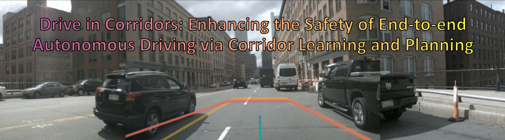
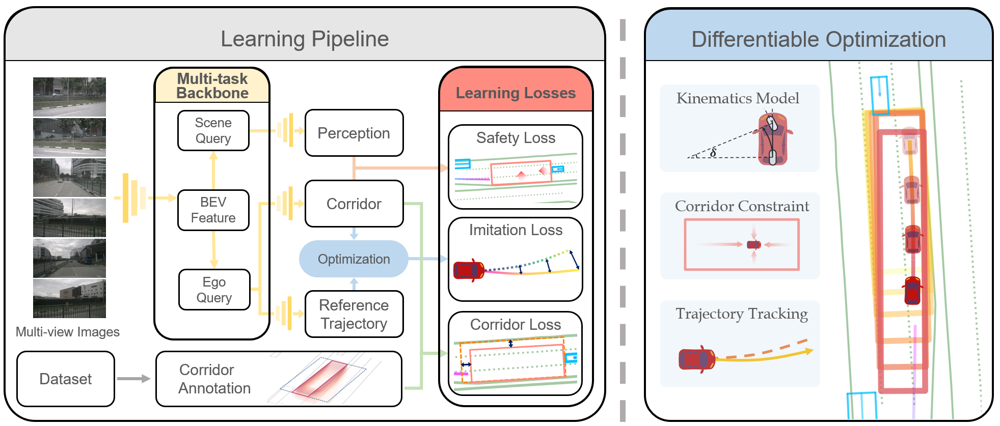

<div align="center">
<h1>Drive in Corridors</h1>
<h3>Enhancing the Safety of End-to-end Autonomous Driving</br> via Corridor Learning and Planning</h3>


Zhiwei Zhang<sup>1</sup>, Ruichen Yang<sup>1</sup>, Ke Wu<sup>1</sup>, Zijun Xu<sup>1</sup>, Jingchu Liu<sup>2</sup>, Lisen Mu<sup>2</sup>, Zhongxue Gan<sup>1</sup>, Wenchao Ding<sup>1 :email:</sup>

<sup>1</sup> Fudan University <sup>2</sup> Horizon Robotics <sup>:email:</sup> corresponding author.
Accepted to RA-L



### [project page](https://zhiwei-pg.github.io/Drive-in-Corridors/) | [arxiv](https://arxiv.org/abs/2504.07507) | [youtube](https://www.youtube.com/watch?v=HHC14VKnrTw) 

</div>

## Introduction 

<div align="center">

</div>

- We propose an explicit and interpretable approach to enhance the safety of autonomous vehicles within the end-to-end framework.
- To the best of our knowledge, we are the first to introduce the safe corridor into learning based autonomous driving. We develop a complete pipeline for corridor learning and demonstrate its effectiveness in improving driving safety.
- A differentiable optimization process incorporating the corridor as the constraint enables the generation of safe trajectories while considering vehicle kinematics, thereby enhancing the interpretability of end-to-end driving.
- Through sufficient and comprehensive validations, our approach demonstrates a significant improvement in the safety of end-to-end planning.


## Models


| Method | Backbone | L2(m) | ACR(%) | CCR(%) | 
| :---: | :---: | :---: | :---: |  :---: | 
| CorDriver | R50 | 0.37 | 0.13 | 0.92 | 
| CorDriver<sup>+</sup> | R50 | 0.38 | 0.11 | 0.85 | 

Model download through [google drive](https://drive.google.com/file/d/1rVqycviJQOsJP3FYJLqNwsIEZ34lex5B/view?usp=drive_link).

## Results
- Open-loop planning results on [nuScenes](https://github.com/nutonomy/nuscenes-devkit).

| Method | L2 (m) 1s | L2 (m) 2s | L2 (m) 3s | ACR (%) 1s | ACR (%) 2s | ACR (%) 3s | CCR (%) 1s | CCR (%) 2s | CCR (%) 3s |
| :---: | :---: | :---: | :---: | :---:| :---: | :---: | :---: | :---: | :---: | 
| ST-P3 | 1.59 | 2.64 | 3.73 | 0.69 | 3.62 | 8.39 | 2.53 | 8.17 | 14.4 |
| UniAD | 0.20 | 0.42 | 0.75 | 0.02 | 0.25 | 0.84 | 0.20 | 1.33 | 3.24 |
| VAD-Base | 0.17 | 0.34 | 0.60 | 0.04 | 0.27 | 0.67 | 0.21 | 2.13 | 5.06 |
| AD-MLP | **0.15** | **0.32** | 0.59 | **0.00** | 0.27 | 0.85 | 0.27 | 2.52 | 6.60 |
| BEV_Planner | 0.16 | **0.32** | **0.57** | **0.00** | 0.29 | 0.73 | 0.35 | 2.62 | 6.51 |
| CorDriver | 0.18 | 0.34 | 0.59 | 0.02 | 0.06 | 0.31 | 0.16 | 0.61 | 2.01 |
| CorDriver | 0.18 | 0.35 | 0.60 | **0.00** | **0.04** | **0.29** | **0.14** | **0.57** | **1.86** |


## Getting Started
- [Installation](docs/install.md)
- [Prepare Dataset](docs/prepare_dataset.md)
- [Train and Eval](docs/train_eval.md)
- [Visualization](docs/visualization.md)
- [Analysis](docs/analysis.md)


## Contact
If you have any questions or suggestions about this repo, please feel free to contact me (real_zhiwei@zju.edu.cn).

## Citation
If you find CorDriver useful in your research or applications, please consider giving us a star &#127775; and citing it by the following BibTeX entry.

```BibTeX
@article{zhang2025drive,
  title={Drive in corridors: Enhancing the safety of end-to-end autonomous driving via corridor learning and planning},
  author={Zhang, Zhiwei and Yang, Ruichen and Wu, Ke and Xu, Zijun and Liu, Jingchu and Mu, Lisen and Gan, Zhongxue and Ding, Wenchao},
  journal={IEEE Robotics and Automation Letters},
  year={2025},
  publisher={IEEE}
}
```

## License
All code in this repository is under the [Apache License 2.0](https://www.apache.org/licenses/LICENSE-2.0).

## Acknowledgement
CorDriver is based on the following projects: [mmdet3d](https://github.com/open-mmlab/mmdetection3d), [BEV-Planner](https://github.com/NVlabs/BEV-Planner) and [VAD](https://github.com/hustvl/VAD). Many thanks for their excellent contributions to the community.
