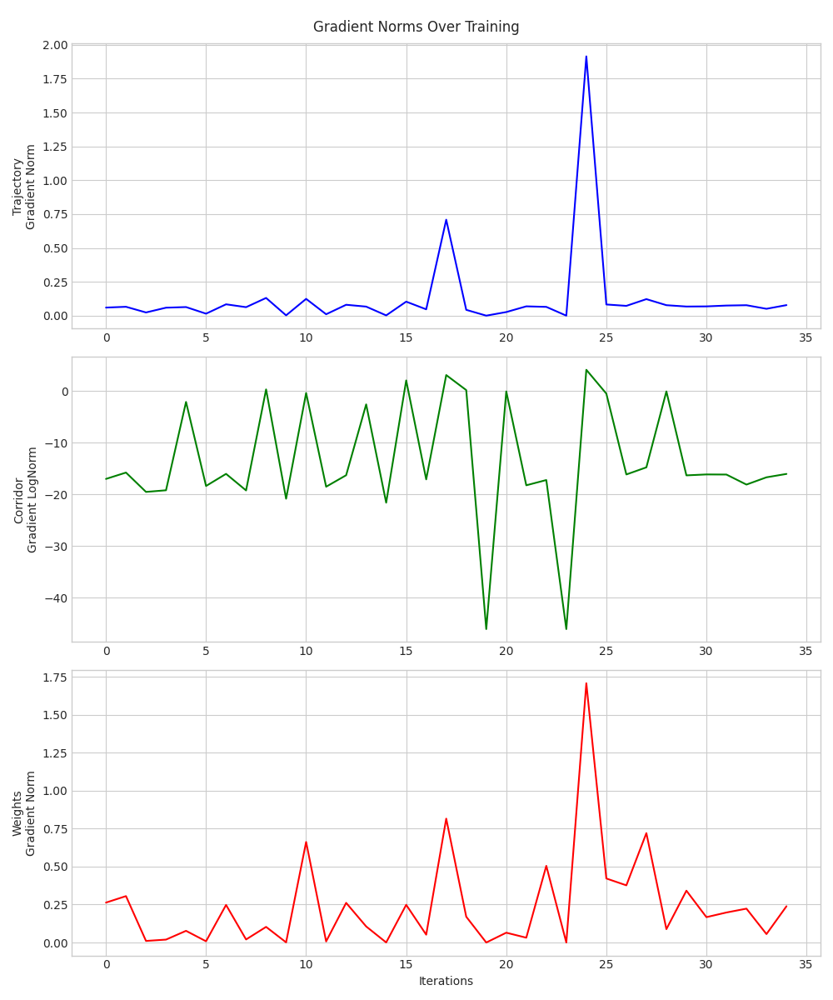

# The Effect of Learnable Parameters in Differentiable Optimization

To study how the differentiable optimization propagates the gradients, we log the gradient norm of the imitation loss with respect to the reference trajectory, corridor prediction, and weight tensor during the initial training steps. The results are shown below. Note that the plotted corridor gradient norm corresponds to the logarithm of the original gradient norm.
The results suggest that unstable gradients prevent the module from achieving significant improvements over the baseline.

